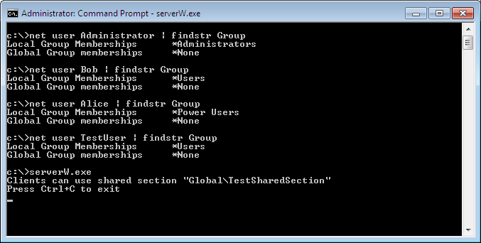
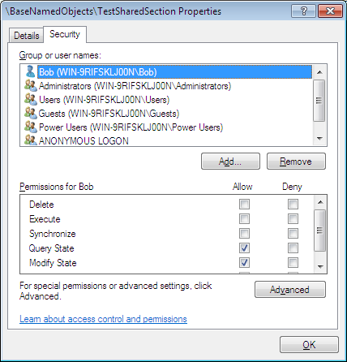
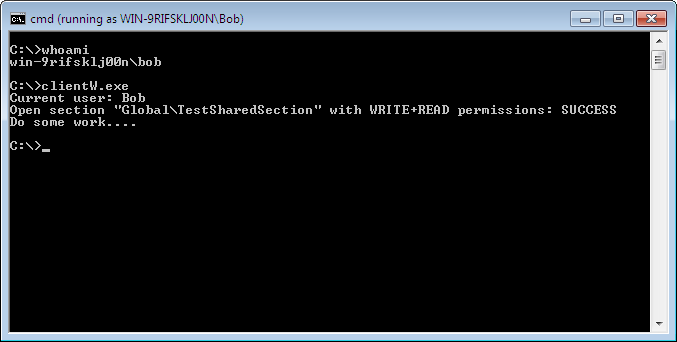
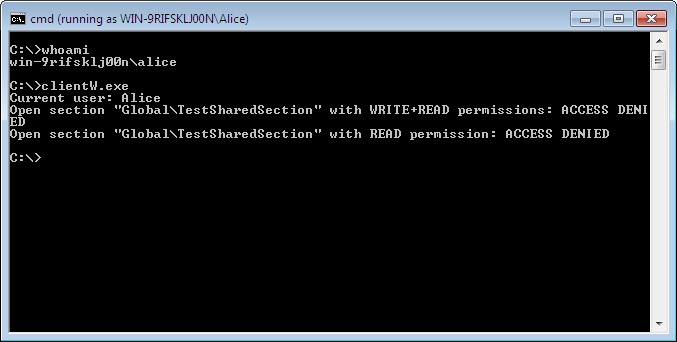
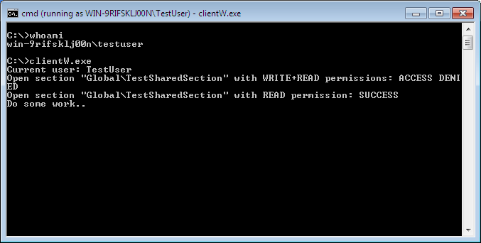
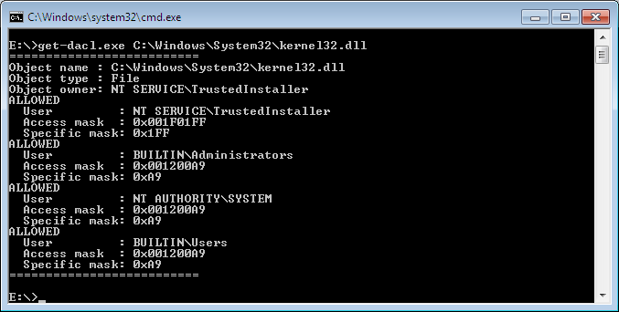
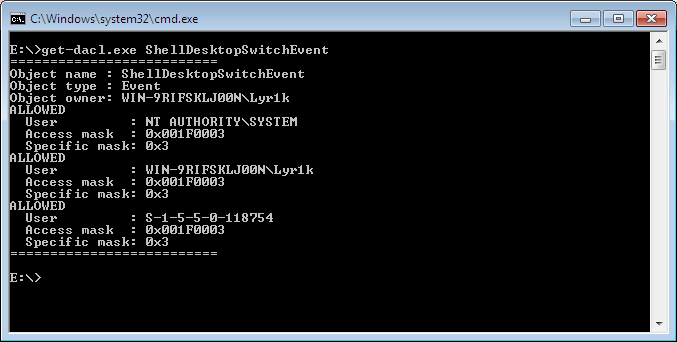

ACL
===

### General information

* server.cpp - This program creates shared section in Global namespace and set permissions.
* client.cpp - This program try to open shared section (since not all users allow open it) and then simulate some work.
* get-dacl.cpp - This program print out the DACL of the named kernel objects (file, event, mutex, etc.).
* common.h - Some useful functions to get information from the DACL and some common constants.

### Usage example of the client-server program
Source computer has the following users:

Shared section has the following permissions:

Bob runs the client:

Alice runs the client:

TestUser runs the client:

As expect Alice wasn't allow to open shared section with any permissions, since Alice belongs to Power Users Group.

### Usage example of get-dacl program
Print out get DACL of the file kernel32.dll:

Print out the DACL of the ShellDesktopSwitchEvent:

